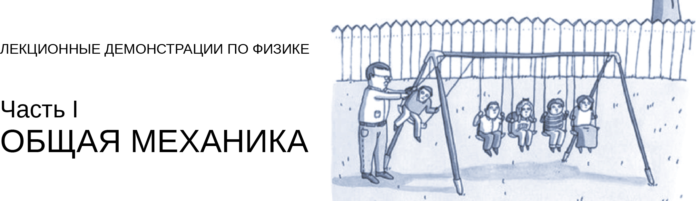
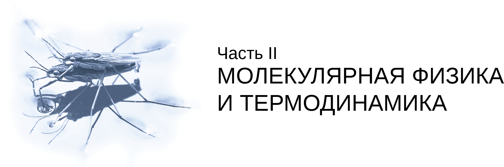

  

**[Глава 1](https://github.com/IvanSboev/demo.online.PSU/tree/master/Chapter-1). Поступательное и вращательное движение**

* Addition of angular velocity ([Сложение угловых скоростей](https://github.com/IvanSboev/demo.online.PSU/tree/master/Chapter-1/Addition%20of%20angular%20velocity))
* Addition of motion ([Сложение движений](https://github.com/IvanSboev/demo.online.PSU/tree/master/Chapter-1/Addition%20of%20motion))
* Inertia ([Инерция тел](https://github.com/IvanSboev/demo.online.PSU/tree/master/Chapter-1/Inertia)) 
* Movement along the «loop» ([Движение тела по «мертвой петле»](https://github.com/IvanSboev/demo.online.PSU/tree/master/Chapter-1/Movement%20along%20the%20loop))
* Newton laws of mechanics ([Второй и третий законы механики Ньютона](https://github.com/IvanSboev/demo.online.PSU/tree/master/Chapter-1/Newton%20laws%20of%20mechanics))
* The law of momentum conservation ([Закон сохранения импульса](https://github.com/IvanSboev/demo.online.PSU/tree/master/Chapter-1/The%20law%20of%20momentum%20conservation))
* Movement by force (Движение тела под влиянием силы)

**[Глава 2](https://github.com/IvanSboev/demo.online.PSU/tree/master/Chapter-2). Динамика твердого тела**

* Center of mass ([Движение центра масс](https://github.com/IvanSboev/demo.online.PSU/tree/master/Chapter-2/Center%20of%20mass))
* Gyroscopic effect ([Гироскопический эффект](https://github.com/IvanSboev/demo.online.PSU/tree/master/Chapter-2/Gyroscopic%20effect))
* Moment of inertia ([Момент инерции](https://github.com/IvanSboev/demo.online.PSU/tree/master/Chapter-2/Moment%20of%20inertia))
* Strange roll ([«Послушная» и  «непослушная» катушка](https://github.com/IvanSboev/demo.online.PSU/tree/master/Chapter-2/Strange%20roll))
* The law of momentum conservation ([Закон сохранения момента импульса](https://github.com/IvanSboev/demo.online.PSU/tree/master/Chapter-2/The%20law%20of%20momentum%20conservation))

**[Глава 3](https://github.com/IvanSboev/demo.online.PSU/tree/master/Chapter-3). Закон сохранения и превращения энергии**

* Ball collision ([Упругий и неупругий удар](https://github.com/IvanSboev/demo.online.PSU/tree/master/Chapter-3/Ball%20collision))
* Maxwell pendulum ([Маятник Максвелла](https://github.com/IvanSboev/demo.online.PSU/tree/master/Chapter-3/Maxwell%20pendulum))
* Potential barrier ([Потенциальный барьер](https://github.com/IvanSboev/demo.online.PSU/tree/master/Chapter-3/Potential%20barrier))
* Rolling cylinder ([Скатывание с наклонной плоскости сплошного и полого цилиндров](https://github.com/IvanSboev/demo.online.PSU/tree/master/Chapter-3/Rolling%20cylinder))
* Transition of energy ([Переход потенциальной энергии в кинетическую и обратный переход](https://github.com/IvanSboev/demo.online.PSU/tree/master/Chapter-3/Transition%20of%20energy))

**Глава 4. Силы инерции, тяготения, трения**
([**Chapter-4**](https://github.com/IvanSboev/demo.online.PSU/tree/master/Chapter-4))

* [Coriolis force](https://github.com/IvanSboev/demo.online.PSU/tree/master/Chapter-4/Coriolis%20force) (Сила Кориолиса)
* [Foucault pendulum](https://github.com/IvanSboev/demo.online.PSU/tree/master/Chapter-4/Foucault%20pendulum) (Маятник Фуко)
* [Frictial forces](https://github.com/IvanSboev/demo.online.PSU/tree/master/Chapter-4/Frictial%20forces) (Силы трения. Сухое и жидкое трение)
* [Inertial forces](https://github.com/IvanSboev/demo.online.PSU/tree/master/Chapter-4/Inertial%20forces) (Действие сил инерции при вращательном движении)
* Free fall (Свободное падение)
* Stagnation phenomenon (Явление застоя)

**Глава 5. Упругие свойства твердых тел**
([**Chapter-5**](https://github.com/IvanSboev/demo.online.PSU/tree/master/Chapter-5))

* [Bending deformation](https://github.com/IvanSboev/demo.online.PSU/tree/master/Chapter-5/Bending%20deformation) (Изгиб)
* [Hooke law](https://github.com/IvanSboev/demo.online.PSU/tree/master/Chapter-5) (Закон Гука)
* Модель деформируемого твердого тела
* Деформация кручения

  

...

Пермский государственный национальный исследовательский университет, Пермь

2018-2019
