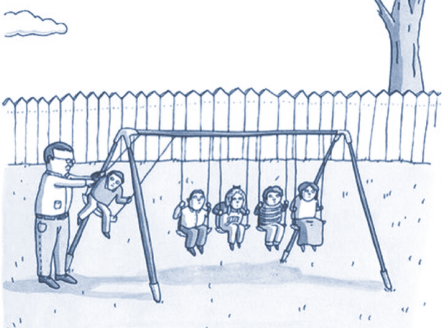

  

**Глава 1. Поступательное и вращательное движение**
([**Chapter-1**](https://github.com/IvanSboev/demo.online.PSU/tree/master/Chapter-1))

* [Addition of angular velocity](https://github.com/IvanSboev/demo.online.PSU/tree/master/Chapter-1/Addition%20of%20angular%20velocity) (Сложение угловых скоростей)
* [Addition of motion](https://github.com/IvanSboev/demo.online.PSU/tree/master/Chapter-1/Addition%20of%20motion) (Сложение движений)
* [Inertia](https://github.com/IvanSboev/demo.online.PSU/tree/master/Chapter-1/Inertia) (Инерция тел) 
* [Movement along the «loop»](https://github.com/IvanSboev/demo.online.PSU/tree/master/Chapter-1/Movement%20along%20the%20loop) (Движение тела по «мертвой петле»)
* [Newton laws of mechanics](https://github.com/IvanSboev/demo.online.PSU/tree/master/Chapter-1/Newton%20laws%20of%20mechanics) (Второй и третий законы механики Ньютона)
* [The law of momentum conservation](https://github.com/IvanSboev/demo.online.PSU/tree/master/Chapter-1/The%20law%20of%20momentum%20conservation) (Закон сохранения импульса)
* Movement by force (Движение тела под влиянием силы)

**Глава 2. Динамика твердого тела**
([**Chapter-2**](https://github.com/IvanSboev/demo.online.PSU/tree/master/Chapter-2) )

* [Center of mass](https://github.com/IvanSboev/demo.online.PSU/tree/master/Chapter-2/Center%20of%20mass) (Движение центра масс)
* [Gyroscopic effect](https://github.com/IvanSboev/demo.online.PSU/tree/master/Chapter-2/Gyroscopic%20effect) (Гироскопический эффект)
* [Moment of inertia](https://github.com/IvanSboev/demo.online.PSU/tree/master/Chapter-2/Moment%20of%20inertia) (Момент инерции)
* [Strange roll](https://github.com/IvanSboev/demo.online.PSU/tree/master/Chapter-2/Strange%20roll) («Послушная» и  «непослушная» катушка)
* [The law of momentum conservation](https://github.com/IvanSboev/demo.online.PSU/tree/master/Chapter-2/The%20law%20of%20momentum%20conservation) (Закон сохранения момента импульса)

**Глава 3. Закон сохранения и превращения энергии**
([**Chapter-3**](https://github.com/IvanSboev/demo.online.PSU/tree/master/Chapter-3))

* [Ball collision](https://github.com/IvanSboev/demo.online.PSU/tree/master/Chapter-3/Ball%20collision) (Упругий и неупругий удар)
* [Maxwell pendulum](https://github.com/IvanSboev/demo.online.PSU/tree/master/Chapter-3/Maxwell%20pendulum) (Маятник Максвелла)
* [Potential barrier](https://github.com/IvanSboev/demo.online.PSU/tree/master/Chapter-3/Potential%20barrier) (Потенциальный барьер)
* [Rolling cylinder](https://github.com/IvanSboev/demo.online.PSU/tree/master/Chapter-3/Rolling%20cylinder) (Скатывание с наклонной плоскости сплошного и полого цилиндров)
* [Transition of energy](https://github.com/IvanSboev/demo.online.PSU/tree/master/Chapter-3/Transition%20of%20energy) (Переход потенциальной энергии в кинетическую и обратный переход)

**Глава 4. Силы инерции, тяготения, трения**
([**Chapter-4**](https://github.com/IvanSboev/demo.online.PSU/tree/master/Chapter-4))

* [Coriolis force](https://github.com/IvanSboev/demo.online.PSU/tree/master/Chapter-4/Coriolis%20force) (Сила Кориолиса)
* [Foucault pendulum](https://github.com/IvanSboev/demo.online.PSU/tree/master/Chapter-4/Foucault%20pendulum) (Маятник Фуко)
* [Frictial forces](https://github.com/IvanSboev/demo.online.PSU/tree/master/Chapter-4/Frictial%20forces) (Силы трения. Сухое и жидкое трение)
* [Inertial forces](https://github.com/IvanSboev/demo.online.PSU/tree/master/Chapter-4/Inertial%20forces) (Действие сил инерции при вращательном движении)
* Free fall (Свободное падение)
* Stagnation phenomenon (Явление застоя)

**Глава 5. Упругие свойства твердых тел**
([**Chapter-5**](https://github.com/IvanSboev/demo.online.PSU/tree/master/Chapter-5))

* [Hooke law](https://github.com/IvanSboev/demo.online.PSU/tree/master/Chapter-5) (Закон Гука)
* Модель деформируемого твердого тела
* Изгиб
* Деформация кручения

...

Пермский государственный национальный исследовательский университет, Пермь

2018-2019
